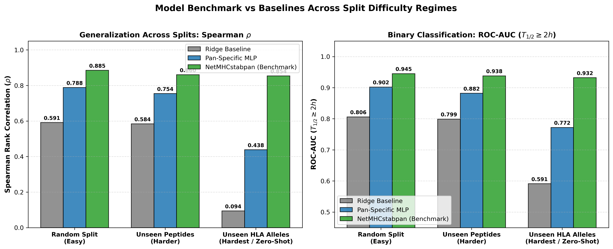
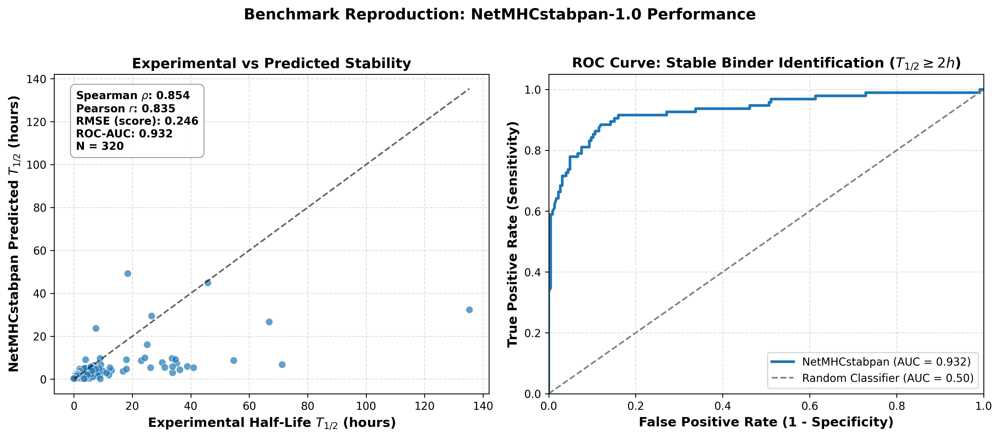
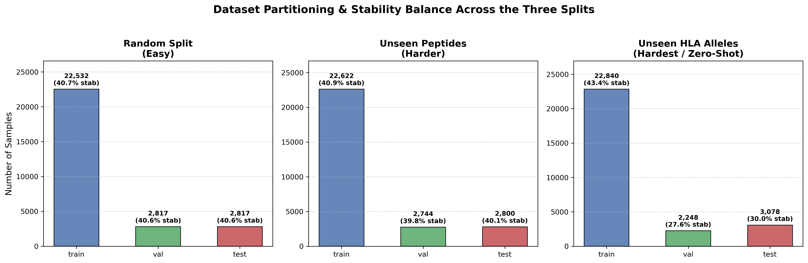

# Pan-Specific Peptide-HLA Stability Prediction & Benchmark

A machine learning framework for predicting peptide-HLA Class I complex stability (half-life $T_{1/2}$ in hours) and benchmarking against the state-of-the-art reference method **NetMHCstabpan-1.0**.

---

## 🔬 Project Overview

Accurately predicting the binding stability of peptide–MHC (pMHC) complexes is a crucial prerequisite for identifying immunogenic neoantigens in personalized cancer vaccines and immunotherapies. 

This repository implements:
1. **Automated Data Curation & Allele Normalization**: Ingests, validates, deduplicates, and standardizes HLA Class I alleles across IMGT (`HLA-A*02:01`), NetMHC (`HLA-A02:01`), and compact shorthand (`A0201`).
2. **IPD-IMGT/HLA & 34-Mer Pseudo-Sequences**: Complete extraction pipeline for mature 182-aa G-domain groove sequences and 34-residue Nielsen contact pocket sequences.
3. **NetMHCstabpan-1.0 Benchmark Reproduction**: Tooling to query the DTU web server, batch export files for non-coders, and compute the target baseline metrics to beat.
4. **Three Leakage-Free Dataset Splits**:
   - **Random Split (Easy)**: i.i.d. evaluation across all pairs.
   - **Unseen Peptides (Harder)**: Zero peptide overlap between train and test.
   - **Unseen HLA Alleles (Hardest / Story Driver)**: Zero allele overlap between train and test (true pan-specific zero-shot extrapolation).
5. **Pan-Specific Baseline Models**: Ridge regression baseline and PyTorch deep neural network evaluated across all three splits.

---

## 📊 Baseline Results

**Evaluation convention.** Every correlation and error below is computed on the single
canonical target $y = \log_{10}(1 + T_{1/2}[\text{h}])$ (see `src/targets.py`).
Earlier revisions of this table mixed scales — Spearman on raw hours, Pearson and RMSE
on the saturating `stability_score` — so the three numbers in a row were not
comparable. Spearman and the AUCs are unchanged by the fix (the transform is
monotone); Pearson and RMSE are not, so RMSE values are **not** comparable to those
in earlier revisions.

MLP numbers are mean ± std over 5 seeds. Ridge is deterministic given the data, so it
carries no seed spread.

| Split Difficulty | Model | Spearman $\rho$ | Pearson $r$ | RMSE | ROC-AUC ($T_{1/2} \geq 2\text{h}$) | Median per-allele $\rho$ |
| :--- | :--- | :---: | :---: | :---: | :---: | :---: |
| **Random Split** (Easy) | Ridge Regression | 0.5885 | 0.5830 | 0.3879 | 0.8015 | 0.2747 |
| | Pan-Specific PyTorch MLP | **0.7871 ± 0.0046** | **0.8186 ± 0.0033** | **0.2759 ± 0.0022** | **0.9018 ± 0.0041** | **0.6804 ± 0.0140** |
| **Unseen Peptides** (Harder) | Ridge Regression | 0.5815 | 0.5760 | 0.3814 | 0.7951 | 0.2691 |
| | Pan-Specific PyTorch MLP | **0.7629 ± 0.0051** | **0.7703 ± 0.0030** | **0.3003 ± 0.0028** | **0.8881 ± 0.0026** | **0.6161 ± 0.0120** |
| **Unseen HLA Alleles** (Hardest) | Ridge Regression | 0.0910 | 0.1873 | 0.5012 | 0.5903 | 0.1402 |
| | Pan-Specific PyTorch MLP | **0.4927 ± 0.0405** | **0.5858 ± 0.0420** | **0.3582 ± 0.0162** | **0.8004 ± 0.0167** | **0.5238 ± 0.0533** |

NetMHCstabpan is **not** listed here, because it was only ever queried for 320 of the
3,078 held-out-allele test pairs and never for the other two splits. Putting its
number in this table would compare it against a different evaluation set. See the
head-to-head below.

### 🎯 Head-to-Head vs NetMHCstabpan (common subset, n = 320)

Scored on exactly the 320 `(allele, peptide)` pairs NetMHCstabpan returned — the only
like-for-like comparison available. Regenerate with `python -m src.head_to_head`;
full output in `reports/head_to_head.json`.

| Model | Spearman $\rho$ | Pearson $r$ | RMSE | ROC-AUC | Median per-allele $\rho$ |
| :--- | :---: | :---: | :---: | :---: | :---: |
| **NetMHCstabpan-1.0** | **0.8537** | **0.8700** | **0.2433** | **0.9323** | **0.7563** |
| Pan-Specific PyTorch MLP | 0.4378 ± 0.0411 | 0.5360 ± 0.0475 | 0.3823 ± 0.0156 | 0.7728 ± 0.0244 | 0.5562 ± 0.0381 |
| Ridge Regression | 0.0385 | 0.1474 | 0.5186 | 0.5661 | 0.1146 |

### Why the per-allele column matters

Pooled $\rho$ on a held-out-allele test set is inflated by between-allele differences
in mean stability: a model that learns only "allele X is generally unstable" scores
respectably without having learned any peptide preference. The median of the
per-allele $\rho$ values removes that between-allele variance.

Two things follow, and both change the story:

- **NetMHCstabpan is weaker than its headline.** Its $\rho$ falls from 0.8537 pooled
  to a median 0.7563 per allele, and the spread across the 8 alleles is wide
  (0.4949 on `HLA-B*45:01` to 0.9095 on `HLA-A*68:01`, std 0.1612). It is not
  uniformly strong on unseen alleles.
- **Our MLP is stronger than its headline**, and in the opposite direction: its
  pooled $\rho$ (0.4378) is *lower* than its median per-allele $\rho$ (0.5562). It
  ranks peptides reasonably well *within* an allele but misplaces the allele-level
  offsets — an allele-calibration problem, not a peptide-preference problem.

So the real gap on unseen alleles is **≈0.20 in median per-allele $\rho$**, not the
≈0.42 the earlier pooled, mismatched-subset comparison implied. Correcting
allele-level calibration is the highest-value target for Phase 2.

---

## 📈 Figures

### Performance Comparison Across Splits


### NetMHCstabpan Benchmark Reproduction


### Dataset Splits & Stability Distribution


---

## 🚀 Quick Start

### 1. Setup Environment
```bash
python3 -m venv venv
source venv/bin/activate
pip install numpy pandas scikit-learn scipy matplotlib seaborn torch requests
```

### 2. Run Automated Unit Tests
```bash
python -m unittest tests/test_phase1.py
```

### 3. Run End-to-End Pipeline
```bash
python run_phase1.py
```

---

## 📁 Repository Structure

```text
├── data/
│   ├── raw/                              # Raw challenge CSV datasets
│   ├── processed/                        # Cleaned & normalized datasets
│   ├── hla_reference/                    # IPD-IMGT/HLA fastas & MHC_pseudo.dat
│   ├── splits/                           # random, unseen_peptides, unseen_alleles
│   └── netmhcstabpan_benchmark/          # Web submission batches & cache
├── figures/                              # Publication-quality benchmark figures
├── reports/                              # head_to_head.json / .md (generated)
├── src/
│   ├── data_cleaning.py                  # Normalizer & validator
│   ├── hla_database.py                   # IMGT sequence & 34-mer pseudo-sequences
│   ├── dataset_splits.py                 # 3 split generators with zero leakage
│   ├── netmhcstabpan_client.py           # DTU webface2 CGI query runner & parser
│   ├── targets.py                        # Canonical target log10(1+thalf); single source of truth
│   ├── head_to_head.py                   # Like-for-like NetMHCstabpan comparison on its 320-pair subset
│   └── evaluate.py                       # Canonical metrics, per-allele breakdown & visualizations
├── models/
│   ├── baseline_model.py                 # Ridge & PyTorch Pan-Specific MLP
│   ├── predictions/                      # Per-row test predictions (gitignored, regenerable)
│   └── checkpoints/                      # Saved PyTorch model weights (.pt)
├── docs/
│   └── NETMHCSTABPAN_GUIDE.md            # Guide for non-coder web server queries
├── tests/
│   └── test_phase1.py                    # Automated test suite
├── run_phase1.py                         # Single-entrypoint pipeline script
└── README.md
```
